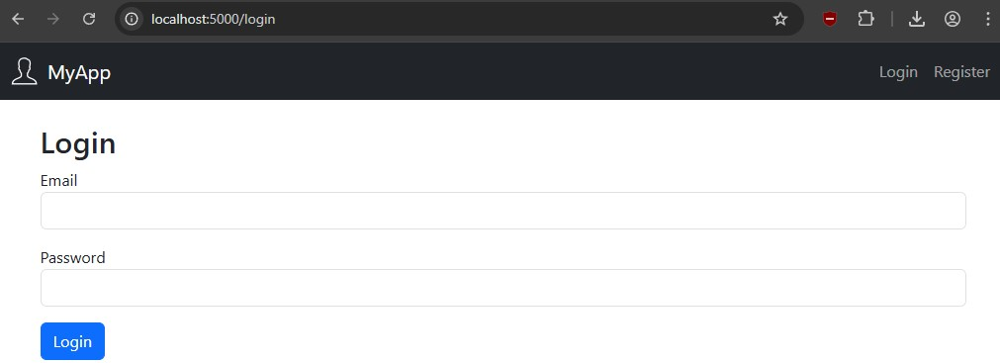

# Flask Web App Template

A beginner-friendly starter project for building a secure, login-enabled Flask web application. It incorporates technologies and design principles aligned with the NESA HSC Software Engineering course. Try using this as a foundation to extend/create your own full-featured app.

Disclaimer: This project is provided as-is for educational purposes. You use it at your own risk. I am not a teacher and am not affiliated with NESA or any official curriculum body.



It uses:

- Flask
- Flask-Login
- Flask-WTF
- SQLAlchemy (with SQLite)
- Bootstrap 5

## Features

- User registration and login
- Admin and regular user roles
- Users can edit their own account information
- Admins can view a table of all users
- Bootstrap-based interface
- Preloaded default admin and regular user accounts
- SQLite database — no setup required

## Project Structure

```
/webapp/
├── app.py                # Main Flask app
├── config.py             # Configuration settings
├── models.py             # SQLAlchemy models
├── forms.py              # WTForms classes
├── seed_db.py            # Seeds the database with some data
├── requirements.txt      # Python package list
├── static/
│   ├── styles.css        # Custom styles
│   └── images/           # Logos and icons etc
├── templates/
│   ├── base.html
│   ├── login.html
│   ├── register.html
│   ├── dashboard.html
│   ├── edit_account.html
│   └── users.html
```

## Default Users

| Role   | Email              | Password   |
|--------|--------------------|------------|
| Admin  | admin@example.com  | admin123   |
| User   | user@example.com   | user123    |

These accounts are seeded automatically when the app runs.

## Getting Started

### 1. Create and activate a virtual environment (optional) 

```bash
python -m venv venv
# On Windows
venv\Scripts\activate
# On macOS/Linux
source venv/bin/activate
```

### 2. Install dependencies

```bash
pip install -r requirements.txt
```

### 3. Run the app

```bash
python app.py
```

Then open [http://localhost:5000](http://localhost:5000) in your browser.

## Security Practices

This project includes several foundational web security best practices. First, all user passwords are **hashed using `Werkzeug`’s secure hashing functions** before being stored in the database. This means even if someone accessed the database file directly, they would not be able to read user passwords. We never store plain-text passwords, and we use the `check_password_hash()` function during login to safely compare password input.

To prevent **Cross-Site Request Forgery (CSRF)** attacks, all forms are built using **Flask-WTF**, which automatically includes a hidden CSRF token in each form and verifies it upon submission. This ensures that only forms served by your site can submit data back to your server. Flask-WTF also protects inputs from **Cross-Site Scripting (XSS)** by escaping HTML characters in form output, helping prevent malicious code from being injected into the page through form fields.

## Accessibility (WCAG Compliance)

The application follows key **WCAG (Web Content Accessibility Guidelines)** principles by using semantic HTML, visible form labels, keyboard-accessible navigation, and responsive design. All forms use proper `<label>` elements paired with input fields to make them accessible to screen readers. The application includes clear heading structure (`<h2>`, `<p>`, etc.), visible validation errors, and uses Bootstrap's accessible components such as alerts, buttons, and collapsible navbars.

Additionally, flash messages (like “Invalid email or password”) are presented using Bootstrap alerts with `role="alert"` to ensure they are announced by screen readers. This ensures that feedback is both visible and accessible. The responsive navigation bar includes a "hamburger" menu that is both mouse- and keyboard-navigable on smaller screens.

## Object-Oriented Design, ORM, and Good Practices

This project demonstrates clean and modular **Object-Oriented Programming (OOP)** by defining a reusable `User` class that encapsulates user-related data and methods such as `set_password()` and `check_password()`. The use of **Flask-SQLAlchemy as an Object-Relational Mapper (ORM)** allows you to interact with the database using Python classes instead of raw SQL queries, which improves readability, safety, and flexibility.

The code follows **good design principles** such as separation of concerns (routes, models, forms, and configuration are split into separate files), reusability (form classes and seed logic), and simplicity (clear, minimal routes and templates). The `Config` class uses environment variables when available, and default values for development. Forms are validated both on the server side and reflected visually to the user. All of this helps make the code easier to understand, maintain, and scale.

## Notes

- The SQLite database (`app.db`) is created automatically on first run.
- Admin access is controlled via the `is_admin` boolean in the `User` model.
- You can add your own styles in `static/styles.css`.
- To change the logo or favicon, replace files in `static/images/`.
- This project could be extended with **unit testing** to check that routes, forms, and login functionality work correctly. A good tool for this in Python is [`pytest`](https://docs.pytest.org/), which makes it easy to write and run test cases.
- For code quality and consistency, consider using **`pylint`** (for catching errors and enforcing best practices) and **`black`** (a code formatter that keeps your code clean and uniform).

## Flask & Jinja Glossary

Here are some of the special tags and syntax you'll see in HTML files used with Flask:

| Syntax                         | What It Means                                                                 |
|--------------------------------|------------------------------------------------------------------------------|
| `{{ something }}`              | Output a value (e.g., a variable or function result)                         |
| `` / `` | Logic control — shows/hides content based on conditions                     |
| ``         | A loop — repeats some content for each item in a list                       |
| ``             | Placeholder that child templates can fill with content                      |
| ``    | Tells a page to reuse layout from `base.html`                               |
| `url_for('route_name')`        | Safely builds a URL to a route or static file                               |
| `current_user`                 | The logged-in user (from Flask-Login)                                       |
| `get_flashed_messages()`       | Shows temporary messages to the user (like “Logged in successfully”)        |

**Note:** Jinja is not HTML — it’s a Python-based template language used by Flask to dynamically generate HTML pages before sending them to the browser.

More info: [Jinja2 Template Docs](https://jinja.palletsprojects.com/) • [Flask Docs](https://flask.palletsprojects.com/)

## License

MIT License — free to use, modify, and share for educational or personal projects.